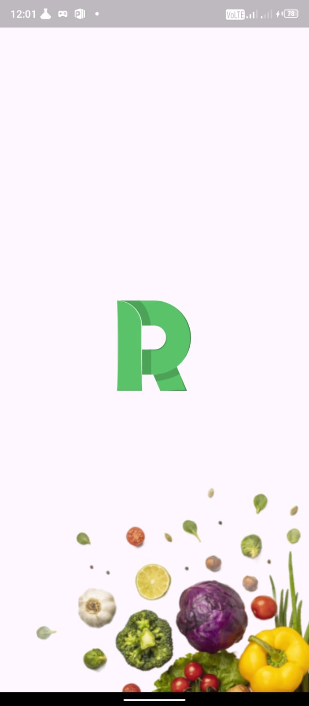
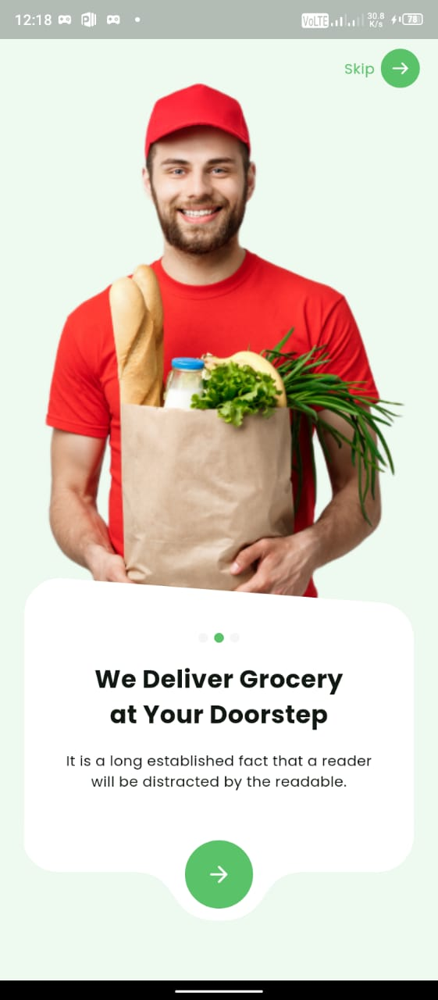
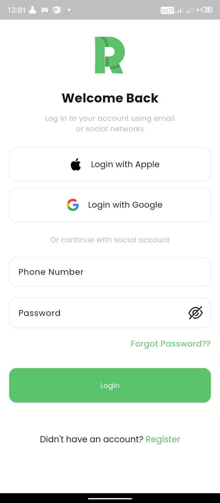
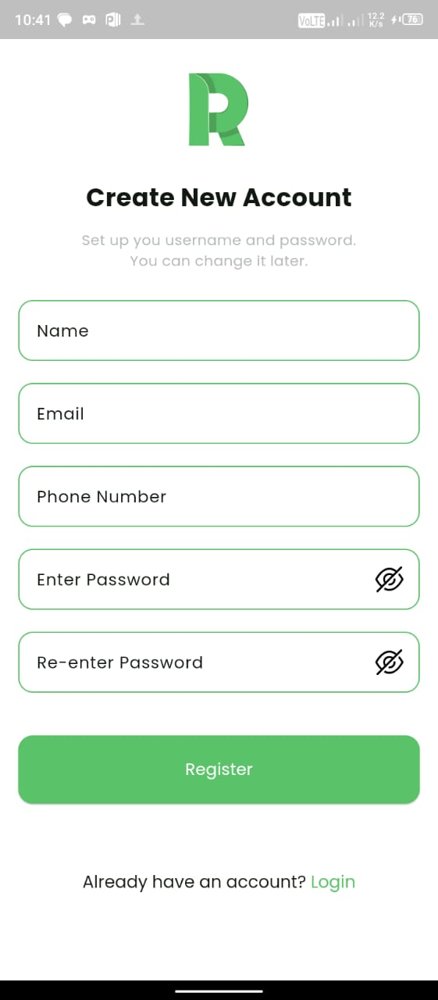
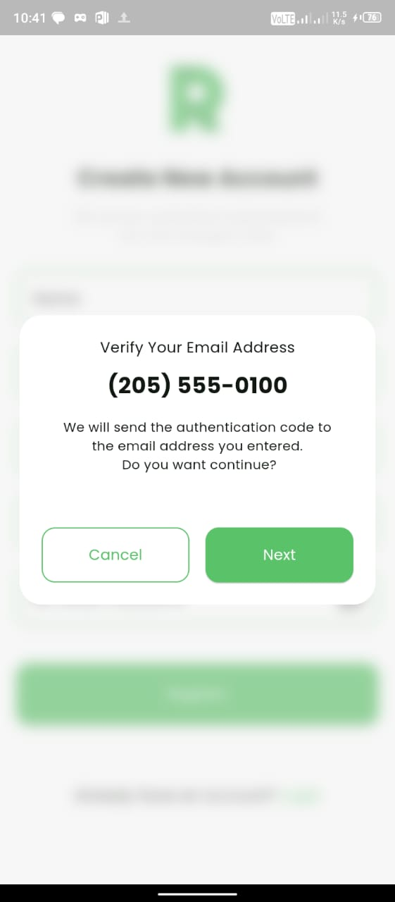
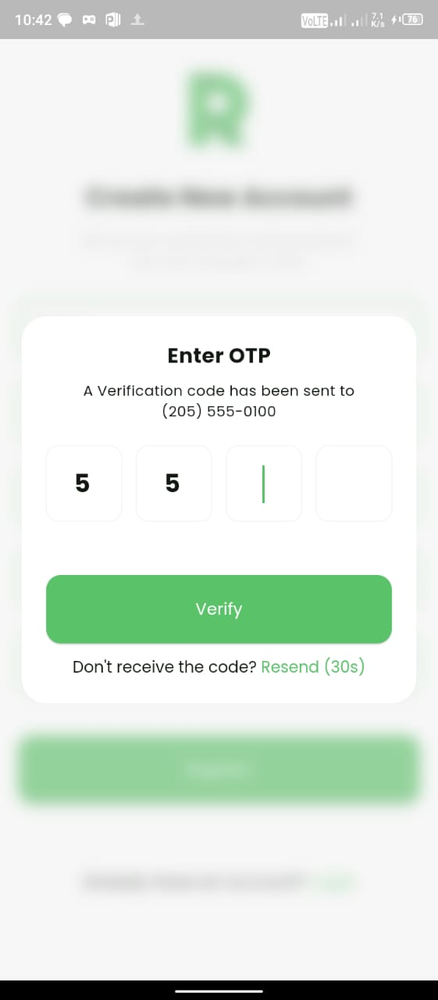
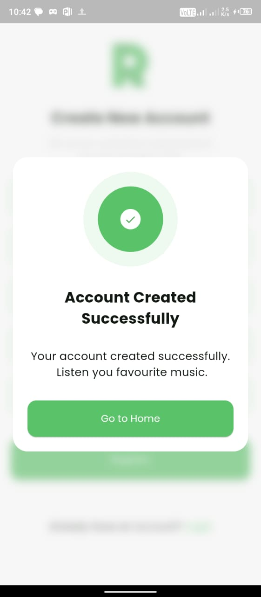

# Gorcery App UI

Grocery App UI design with Flutter.

## Getting Started

I have us ClipPath in the project for making Custom Shape of some widgets.

### Splash Screen
   Here is output:  

    

### Onboarding Screens
   Here is output:  

    
     
      

### Login Screens
   Here is output:  

    
    

### Creating Account Screens
   Here is output:  

    
    
    

